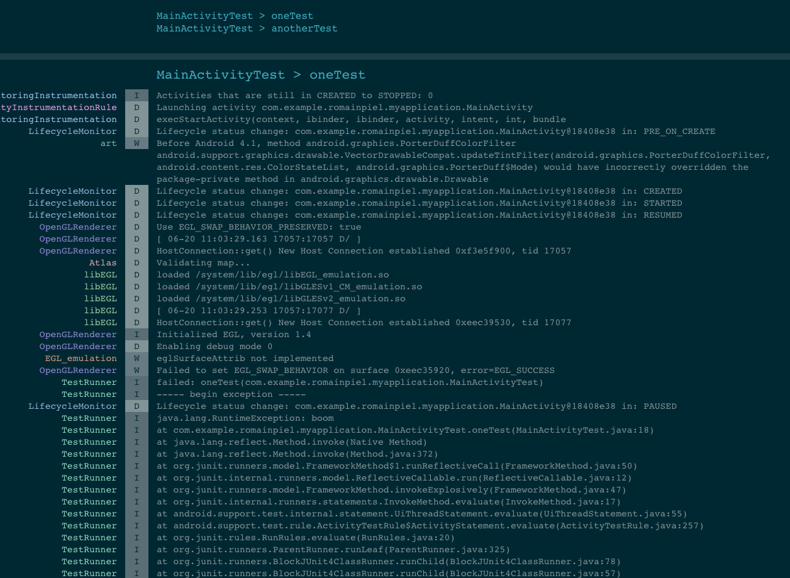

# Catalog

Catalog is a gradle plugin for Android that records logs when running Espresso tests.
It will run automatically with `connected{Variant}AndroidTest` tasks and print the LogCat into `app/build/outputs/androidTest-results/`:


To include it in your project:
```gradle
buildscript {
    repositories {
        jcenter()
    }
    dependencies {
        classpath "com.songkick:catalog:0.1"
    }
}

apply plugin: 'com.android.application'
apply plugin: 'com.songkick.catalog'
```